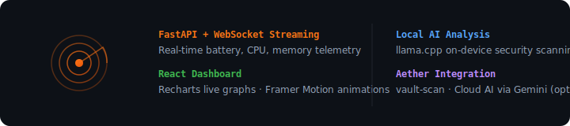

<div align="center">

# 🛡️ E D G E - S E N T I N E L
### *Real-Time Hardware Telemetry & Security Monitoring.*

[]()
[]()
[](LICENSE)

**[📲 Download](https://github.com/earnerbaymalay/edge-sentinel/releases)** · **[🌐 Sideload Hub](https://earnerbaymalay.github.io/sideload/)**

</div>

---



## What is Edge Sentinel?

**Security monitoring with a real-time telemetry dashboard.** FastAPI backend streams battery, CPU, and memory data over WebSockets to a React dashboard. Local AI analysis via llama.cpp, optional cloud analysis via Gemini. Integrates with Aether for vault-scan.

---

## Quick Start

### Backend

```bash
cd backend && pip install -r requirements.txt
python main.py
```

### Frontend

```bash
npm install
npm run dev
```

Dashboard: `http://localhost:5173` · API: `http://localhost:8000`

---

## Features

| Feature | Description |
|---------|-------------|
| **Hardware telemetry** | Real-time battery, CPU, memory monitoring. |
| **WebSocket streaming** | FastAPI backend pushes live data to dashboard. |
| **React dashboard** | Recharts live graphs · Framer Motion animations. |
| **Local AI analysis** | llama.cpp on-device security scanning. |
| **Cloud AI (optional)** | Gemini API analysis for deeper insights. |
| **Aether integration** | vault-scan integration for security audits. |

---

## Architecture

```
edge-sentinel/
├── backend/main.py       # FastAPI + WebSocket telemetry server
├── src/App.tsx           # React dashboard
├── src/components/       # Chart, metric, and alert components
├── server.ts             # Express + Socket.io (legacy)
├── vite.config.ts
└── package.json
```

---

## Related Projects

<div align="center">

| Project | Platform | Description | Link |
|---------|----------|-------------|------|
| 🌌 **Aether** | 📱 Android (Termux) | Local-first AI workstation | [Source →](https://github.com/earnerbaymalay/aether) |
| 🌗 **Gloam** | 📱 Android / 🖥️ Desktop | Solar-timed CBT journal | [Source →](https://github.com/earnerbaymalay/Gloam) |
| 🛡️ **Cyph3rChat** | 📱 Android | E2E encrypted messaging | [Source →](https://github.com/earnerbaymalay/cyph3rchat) |
| 📲 **Sideload Hub** | 🌐 Web / PWA | Central app distribution | [Open Hub →](https://earnerbaymalay.github.io/sideload/) |

</div>

---

## Documentation

- **[📖 Usage Guide](USAGE.md)** — Setup instructions, dashboard navigation, configuration.
- **[🔧 Troubleshooting](TROUBLESHOOTING.md)** — Common issues, WebSocket errors, build fixes.

---

[MIT License](LICENSE)
